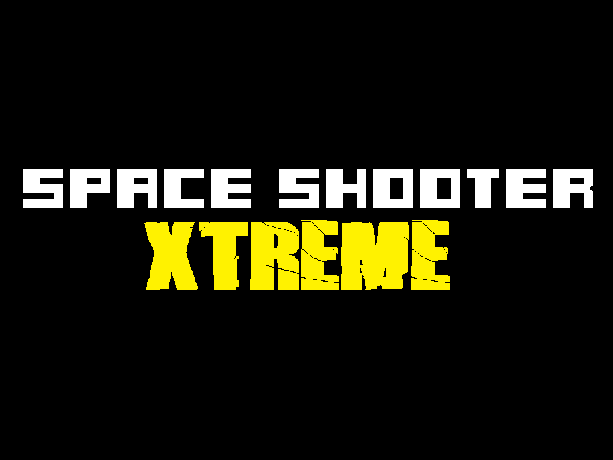

<a name="readme-top"></a>

[![Contributors][contributors-shield]][contributors-url]
[![Forks][forks-shield]][forks-url]
[![Stargazers][stars-shield]][stars-url]
[![Issues][issues-shield]][issues-url]
[![MIT License][license-shield]][license-url]
[![LinkedIn][linkedin-shield]][linkedin-url]

<!-- PROJECT LOGO -->
<br />
<div align="center">
  <a href="https://github.com/alperrkilic/Space-Shooter-Project">
    
  </a>

  <h3 align="center">Space Shooter Game</h3>

  <p align="center">
    A Game Project
    <br />
    <a href="https://github.com/alperrkilic/Space-Shooter-Project"><strong>Explore the docs »</strong></a>
    <br />
    <br />
    <a href="https://github.com/alperrkilic/Space-Shooter-Project">View Demo</a>
    ·
    <a href="https://github.com/alperrkilic/Space-Shooter-Project/issues">Report Bug</a>
    ·
    <a href="https://github.com/alperrkilic/Space-Shooter-Project/issues">Request Feature</a>
  </p>
</div>


<!-- TABLE OF CONTENTS -->
<details>
  <summary>Table of Contents</summary>
  <ol>
    <li>
      <a href="#about-the-project">About The Project</a>
      <ul>
        <li><a href="#built-with">Built With</a></li>
      </ul>
    </li>
    <li>
      <a href="#getting-started">Getting Started</a>
      <ul>
        <li><a href="#prerequisites">Prerequisites</a></li>
        <li><a href="#source-codes">Source Codes</a></li>
      </ul>
    </li>
    <!-- <li><a href="#usage">Usage</a></li> -->
    <li><a href="#gameplay-footage">Gameplay Footage</a></li>
    <!-- <li><a href="#contributing">Contributing</a></li> -->
    <li><a href="#license">License</a></li>
    <li><a href="#contact">Contact</a></li>
    <li><a href="#acknowledgments">Acknowledgments</a></li>
  </ol>
</details>


<!-- ABOUT THE PROJECT -->
## About The Project


Space Shooter is a thrilling 2D game developed by a solo game developer who utilized Unity and C# to create an immersive gameplay experience. In this game, you take on the role of a skilled space pilot who must fight off waves of enemy spaceships and survive for as long as possible. You have three lives and must avoid getting hit by enemy lasers while collecting power-ups to increase your chances of survival. The power-ups include speed, shield, and triple shot, which can give you a temporary advantage. However, be careful as your shield can be destroyed if you collide with an enemy or enemy laser. The game becomes more challenging as you progress, with enemies spawning more frequently, making it harder to dodge their lasers. With its addictive gameplay and fast-paced action, Space Shooter is a must-play for fans of space-themed games.

<p align="right">(<a href="#readme-top">back to top</a>)</p>


### Built With

Space Shooter was developed using C# programming language and the Unity game engine.

* [![csharp][csharp]][csharp-url]
* [![unity][unity]][unity-url]


<p align="right">(<a href="#readme-top">back to top</a>)</p>


<!-- GETTING STARTED -->
## Getting Started

To open Space Shooter, you will need to have Unity version 2021.3.21f1 and Microsoft Visual Studio Code 2019 installed on your computer. Unity is a game engine that is used to develop and run the game, while Microsoft Visual Studio Code 2019 is the integrated development environment (IDE) that is used to write the C# scripts for the game.

### Prerequisites

To install the required programs, please refer to these websites: 

  ```sh
  Unity: https://unity.com/
  ```
  ```sh
  Microsoft Visual Studio Code 2019: https://code.visualstudio.com/
  ```


### Source Codes

_You can access the source code for Space Shooter and contribute to the game's development. Additionally, you can use the source code as a starting point to create your own games based on the Space Shooter._

1. Create new Project in Unity
2. Clone the repository to your local machine:
   ```sh
   git clone https://github.com/alperrkilic/Space-Shooter-Project
   ```
3. Install the required dependencies:
   ```sh
   Visual Studio 2019 && Unity Personal || Unity Student
   ```

4. Open the project in Visual Studio 2019 or your preferred code editor.
   ```js
   That's it! You're now ready reach the codes for Space Shooter.
   ```

<p align="right">(<a href="#readme-top">back to top</a>)</p>


<!-- Images -->
## Gameplay Footage

[![Screen Shots][main-menu]](https://github.com/alperrkilic/Space-Shooter-Project)

_This is the main menu screen of the game_


[![Screen Shots][shoot-to-start]](https://github.com/alperrkilic/Space-Shooter-Project)

_In order to start the game, you have to shoot the Astroid._


[![Screen Shots][shields]](https://github.com/alperrkilic/Space-Shooter-Project)

_When you collect a shield power-up, you can avoid one enemy laser collision. The power-up lasts 5 seconds._


[![Screen Shots][game-over]](https://github.com/alperrkilic/Space-Shooter-Project)

_If your ship gets hit 3 times, it will explode and you will need to restart the game._


<p align="right">(<a href="#readme-top">back to top</a>)</p>


<!-- LICENSE -->
## License

Distributed under the MIT License. See `LICENSE.txt` for more information.

<p align="right">(<a href="#readme-top">back to top</a>)</p>


<!-- CONTACT -->
## Contact

Bayram Alper KILIÇ - [@alperrkilic](https://www.linkedin.com/in/bayram-alper-kilic/) - alperkilicbusiness@gmail.com

Project Link: [https://github.com/alperrkilic/Space-Shooter-Project](https://github.com/alperrkilic/Space-Shooter-Project)

<p align="right">(<a href="#readme-top">back to top</a>)</p>


<!-- ACKNOWLEDGMENTS -->
## Acknowledgments

Developing a game like Space Shooter requires a significant amount of research, experimentation, and dedication. I would like to express my gratitude to the many individuals, forums, and websites that provided me with invaluable resources and support throughout the development process. Without their contributions, this game would not have been possible. In particular, I would like to recommend the following resources for their valuable insights into game development, Unity, and C#.

* [Jonathan Weinberger](https://www.udemy.com/user/jonathan-weinberger/)
* [ChatGPT](https://chat.openai.com/chat)
* [Choose an Open Source License](https://choosealicense.com)
* [Img Shields](https://shields.io)


<p align="right">(<a href="#readme-top">back to top</a>)</p>

[contributors-shield]: https://img.shields.io/github/contributors/alperrkilic/Space-Shooter-Project.svg?style=for-the-badge
[contributors-url]: https://github.com/alperrkilic/Space-Shooter-Project/graphs/contributors
[forks-shield]: https://img.shields.io/github/forks/alperrkilic/Space-Shooter-Project.svg?style=for-the-badge
[forks-url]: https://github.com/alperrkilic/Space-Shooter-Project/forks
[stars-shield]: https://img.shields.io/github/stars/alperrkilic/Space-Shooter-Project.svg?style=for-the-badge
[stars-url]: https://github.com/alperrkilic/Space-Shooter-Project/stargazers
[issues-shield]: https://img.shields.io/github/issues/alperrkilic/Space-Shooter-Project.svg?style=for-the-badge
[issues-url]: https://github.com/alperrkilic/Space-Shooter-Project/issues
[license-shield]: https://img.shields.io/github/license/alperrkilic/Space-Shooter-Project.svg?style=for-the-badge
[license-url]: https://github.com/alperrkilic/Space-Shooter-Project/blob/master/LICENSE.txt

<!-- Built with and Social Media -->
[linkedin-shield]: https://img.shields.io/badge/-LinkedIn-black.svg?style=for-the-badge&logo=linkedin&colorB=555
[linkedin-url]: https://www.linkedin.com/in/bayram-alper-kilic/
[csharp]: https://img.shields.io/badge/C%23-239120?style=for-the-badge&logo=c-sharp&logoColor=white
[csharp-url]: https://learn.microsoft.com/en-us/dotnet/csharp/
[unity]: https://img.shields.io/badge/Unity-100000?style=for-the-badge&logo=unity&logoColor=white
[unity-url]: https://unity.com/


<!-- images -->
[product-screenshot]: Readme-Images/space-shooter.gif
[shields]: Readme-Images/shield.png
[main-menu]: Readme-Images/main-menu.png
[game-over]: Readme-Images/game-over.png
[shoot-to-start]: Readme-Images/shoot-to-start.png
